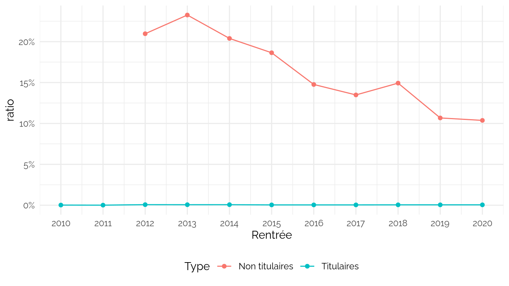
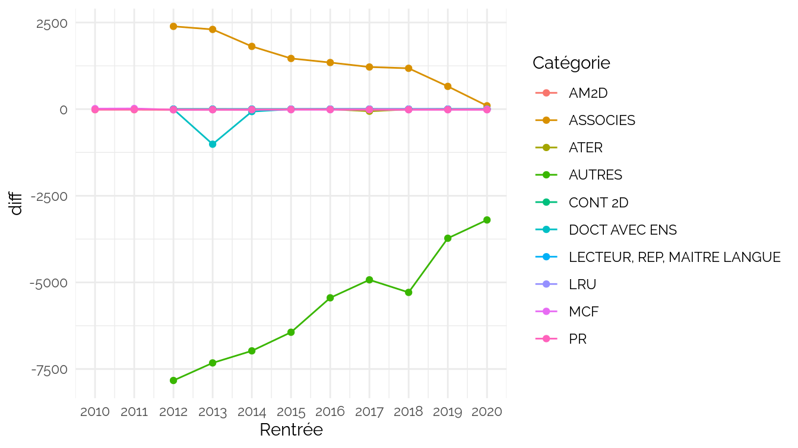
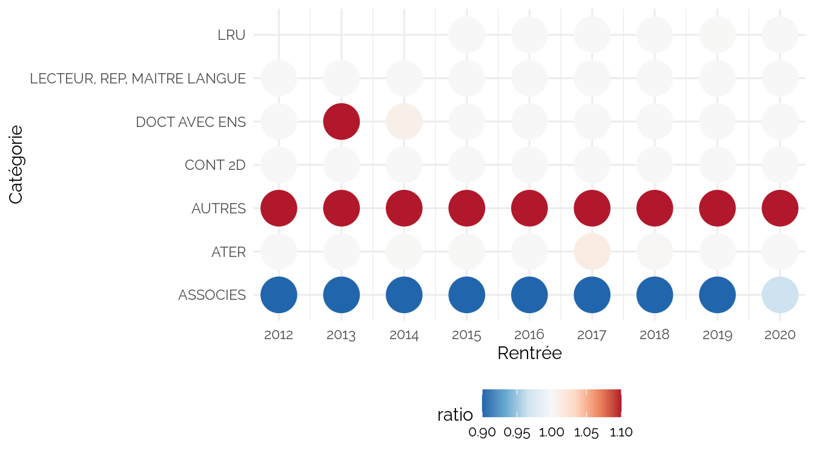
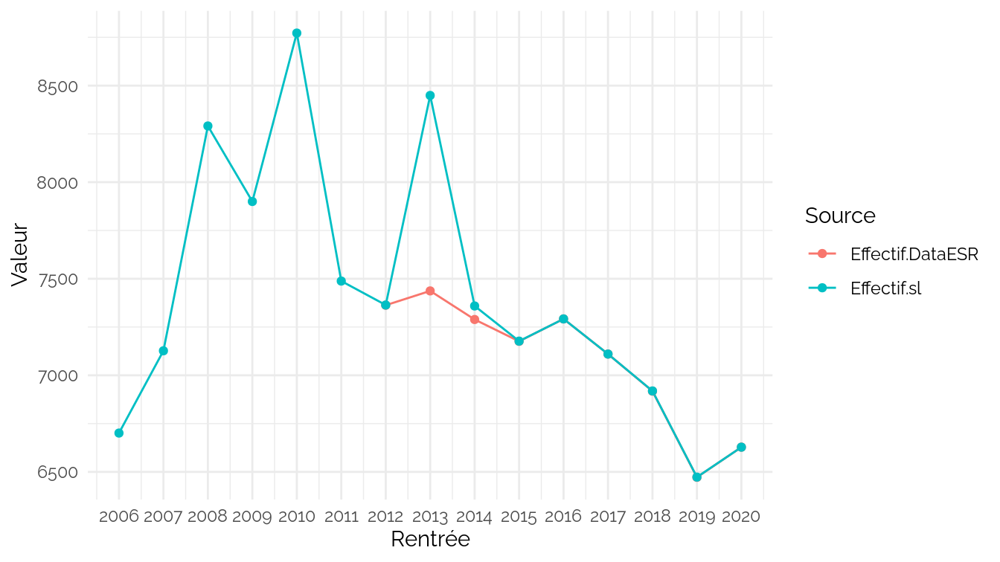
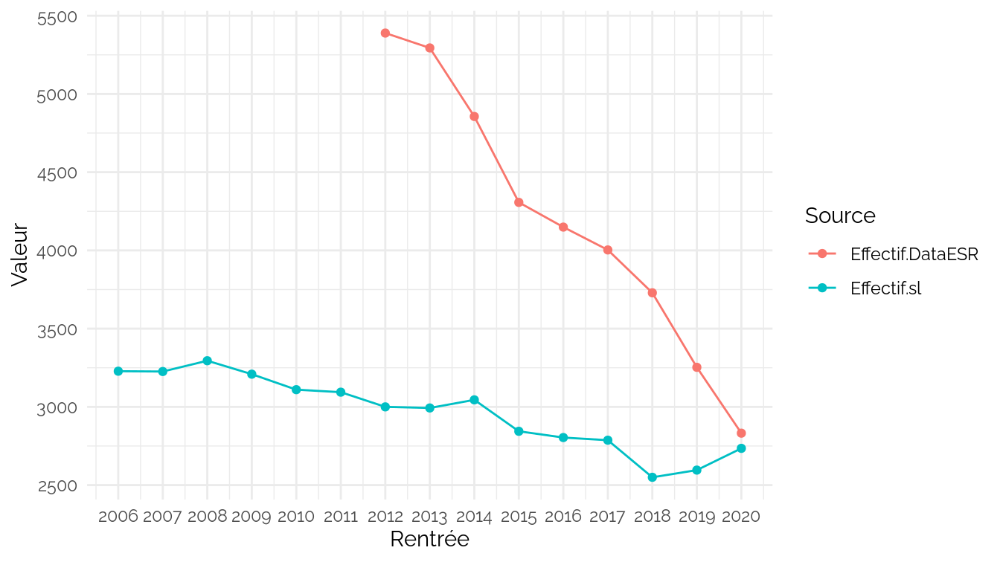
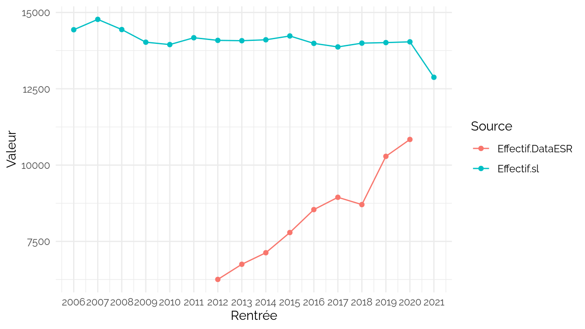
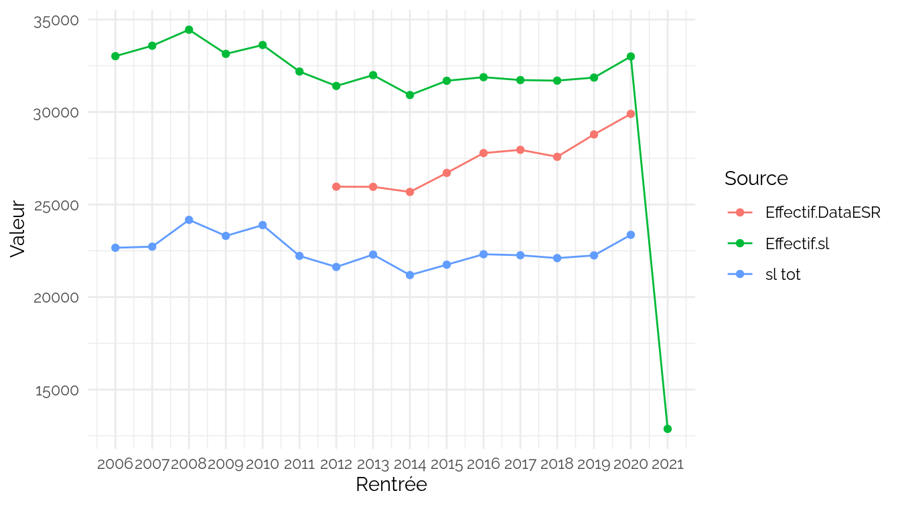

CPESR
================
CPESR
2023-05-05

## Données

### Série longue

- <https://www.data.gouv.fr/fr/datasets/evolution-du-nombre-de-personnels-enseignants-de-lenseignement-superieur-public/>

<!-- -->

    ##  [1] "annee"                                
    ##  [2] "annee_scolaire"                       
    ##  [3] "source"                               
    ##  [4] "statut_pu"                            
    ##  [5] "statut_pu_sl"                         
    ##  [6] "statut_ma_mcf"                        
    ##  [7] "statut_mcf_sl"                        
    ##  [8] "statut_assistant_hors_medecine"       
    ##  [9] "statut_chefs_clinique"                
    ## [10] "statut_assistant_total"               
    ## [11] "statut_ma_assistant_total"            
    ## [12] "statut_ens_associes_inclus_mcf_pu"    
    ## [13] "statut_ens_associes"                  
    ## [14] "statut_ens_chercheurs"                
    ## [15] "statut_2d_sup"                        
    ## [16] "statut_lecteurs"                      
    ## [17] "statut_autres"                        
    ## [18] "statut_ater"                          
    ## [19] "statut_moniteur_doctorant_contractuel"
    ## [20] "statut_ater_moniteur"                 
    ## [21] "statut_contractuels_lru"              
    ## [22] "statut_contractuels_2d"               
    ## [23] "statut_total_non_titulaires"          
    ## [24] "statut_total"

### Total

<table>
<thead>
<tr>
<th style="text-align:right;">
annee
</th>
<th style="text-align:right;">
statut_ens_chercheurs
</th>
<th style="text-align:right;">
statut_pu
</th>
<th style="text-align:right;">
statut_ma_mcf
</th>
<th style="text-align:right;">
statut_assistant_hors_medecine
</th>
<th style="text-align:right;">
statut_total
</th>
</tr>
</thead>
<tbody>
<tr>
<td style="text-align:right;">
1928
</td>
<td style="text-align:right;">
1014
</td>
<td style="text-align:right;">
723
</td>
<td style="text-align:right;">
NA
</td>
<td style="text-align:right;">
291
</td>
<td style="text-align:right;">
1014
</td>
</tr>
<tr>
<td style="text-align:right;">
1960
</td>
<td style="text-align:right;">
7136
</td>
<td style="text-align:right;">
3585
</td>
<td style="text-align:right;">
NA
</td>
<td style="text-align:right;">
NA
</td>
<td style="text-align:right;">
7901
</td>
</tr>
<tr>
<td style="text-align:right;">
1970
</td>
<td style="text-align:right;">
33647
</td>
<td style="text-align:right;">
8516
</td>
<td style="text-align:right;">
8524
</td>
<td style="text-align:right;">
11458
</td>
<td style="text-align:right;">
35137
</td>
</tr>
<tr>
<td style="text-align:right;">
1980
</td>
<td style="text-align:right;">
38661
</td>
<td style="text-align:right;">
10430
</td>
<td style="text-align:right;">
14839
</td>
<td style="text-align:right;">
8315
</td>
<td style="text-align:right;">
42213
</td>
</tr>
<tr>
<td style="text-align:right;">
1990
</td>
<td style="text-align:right;">
42342
</td>
<td style="text-align:right;">
14522
</td>
<td style="text-align:right;">
21326
</td>
<td style="text-align:right;">
2688
</td>
<td style="text-align:right;">
53110
</td>
</tr>
<tr>
<td style="text-align:right;">
2000
</td>
<td style="text-align:right;">
58214
</td>
<td style="text-align:right;">
18991
</td>
<td style="text-align:right;">
33570
</td>
<td style="text-align:right;">
1460
</td>
<td style="text-align:right;">
83925
</td>
</tr>
<tr>
<td style="text-align:right;">
2010
</td>
<td style="text-align:right;">
63599
</td>
<td style="text-align:right;">
21084
</td>
<td style="text-align:right;">
38231
</td>
<td style="text-align:right;">
35
</td>
<td style="text-align:right;">
93020
</td>
</tr>
<tr>
<td style="text-align:right;">
2020
</td>
<td style="text-align:right;">
62503
</td>
<td style="text-align:right;">
20100
</td>
<td style="text-align:right;">
35269
</td>
<td style="text-align:right;">
NA
</td>
<td style="text-align:right;">
91708
</td>
</tr>
<tr>
<td style="text-align:right;">
2021
</td>
<td style="text-align:right;">
59744
</td>
<td style="text-align:right;">
20144
</td>
<td style="text-align:right;">
35186
</td>
<td style="text-align:right;">
NA
</td>
<td style="text-align:right;">
NA
</td>
</tr>
</tbody>
</table>

### DataESR

    ##  [1] "Rentrée"                                                   
    ##  [2] "Établissement"                                             
    ##  [3] "Type.établissement"                                        
    ##  [4] "Sexe"                                                      
    ##  [5] "Categorie.de.personnels"                                   
    ##  [6] "Grandes.disciplines"                                       
    ##  [7] "Groupes.CNU"                                               
    ##  [8] "Sections.CNU"                                              
    ##  [9] "Code.categorie.personnels"                                 
    ## [10] "Code.groupe.CNU"                                           
    ## [11] "Code.grande.discipline"                                    
    ## [12] "effectif"                                                  
    ## [13] "code_section_cnu"                                          
    ## [14] "Année.universitaire"                                       
    ## [15] "etablissement_id_paysage"                                  
    ## [16] "etablissement_compos_id_paysage"                           
    ## [17] "Décomposition.pour.les.universités.à.statuts.expérimentaux"
    ## [18] "etablissement_id_uai"                                      
    ## [19] "etablissement_code_academie"                               
    ## [20] "Académie"                                                  
    ## [21] "etablissement_code_region"                                 
    ## [22] "Région"                                                    
    ## [23] "etablissement_coordonnees"                                 
    ## [24] "etablissement_id_uai_source"                               
    ## [25] "etablissement_id_paysage_actuel"                           
    ## [26] "etablissement_actuel_lib"                                  
    ## [27] "classe_age3"                                               
    ## [28] "quotite"                                                   
    ## [29] "Grande.discipline"                                         
    ## [30] "Décomposition.des.universitéss.à.statuts.expérimentaux"    
    ## [31] "code_academie"                                             
    ## [32] "code_categorie_persg"                                      
    ## [33] "Categorie.personnels.regroupées"                           
    ## [34] "Quotité"                                                   
    ## [35] "Classes.d.âge"

Statuts des données ouvertes :

    ##  [1] "PR"                 "AM2D"               "MCF"               
    ##  [4] "PR ASS-INV"         "ATER"               "DOCT AVEC ENS"     
    ##  [7] "DOCT SANS ENS"      "MCF ASS-INV"        "CONT 2D"           
    ## [10] "LECTEUR ET REP"     "MAITRE LANGUE"      "LRU"               
    ## [13] "ASS INV (corps NR)"

## Reformatages

    ## Joining, by = c("Rentrée", "Catégorie")

## Vérification

### Total

Attention : 2010 et 2011 ne comparent que les permanents.

### Détail

Voir les données

| Rentrée | Catégorie                   | Effectif.DataESR | Effectif.sl | Type           |  diff |     ratio |
|--------:|:----------------------------|-----------------:|------------:|:---------------|------:|----------:|
|    2010 | AM2D                        |            12875 |       12891 | Titulaires     |   -16 | 1.0012427 |
|    2010 | MCF                         |            36258 |       36244 | Titulaires     |    14 | 0.9996139 |
|    2010 | PR                          |            19953 |       19964 | Titulaires     |   -11 | 1.0005513 |
|    2011 | AM2D                        |            13123 |       13139 | Titulaires     |   -16 | 1.0012192 |
|    2011 | MCF                         |            36357 |       36338 | Titulaires     |    19 | 0.9994774 |
|    2011 | PR                          |            20061 |       20070 | Titulaires     |    -9 | 1.0004486 |
|    2012 | AM2D                        |            13037 |       13056 | Titulaires     |   -19 | 1.0014574 |
|    2012 | ASSOCIES                    |             5389 |        3000 | Non titulaires |  2389 | 0.5566896 |
|    2012 | ATER                        |             5322 |        5323 | Non titulaires |    -1 | 1.0001879 |
|    2012 | AUTRES                      |             6255 |       14086 | Non titulaires | -7831 | 2.2519584 |
|    2012 | CONT 2D                     |              606 |         606 | Non titulaires |     0 | 1.0000000 |
|    2012 | DOCT AVEC ENS               |             7363 |        7364 | Non titulaires |    -1 | 1.0001358 |
|    2012 | LECTEUR, REP, MAITRE LANGUE |             1030 |        1030 | Non titulaires |     0 | 1.0000000 |
|    2012 | MCF                         |            36351 |       36369 | Titulaires     |   -18 | 1.0004952 |
|    2012 | PR                          |            20234 |       20245 | Titulaires     |   -11 | 1.0005436 |
|    2013 | AM2D                        |            13054 |       13069 | Titulaires     |   -15 | 1.0011491 |
|    2013 | ASSOCIES                    |             5294 |        2993 | Non titulaires |  2301 | 0.5653570 |
|    2013 | ATER                        |             4871 |        4872 | Non titulaires |    -1 | 1.0002053 |
|    2013 | AUTRES                      |             6751 |       14075 | Non titulaires | -7324 | 2.0848763 |
|    2013 | CONT 2D                     |              599 |         599 | Non titulaires |     0 | 1.0000000 |
|    2013 | DOCT AVEC ENS               |             7437 |        8449 | Non titulaires | -1012 | 1.1360764 |
|    2013 | LECTEUR, REP, MAITRE LANGUE |             1006 |        1006 | Non titulaires |     0 | 1.0000000 |
|    2013 | MCF                         |            36538 |       36555 | Titulaires     |   -17 | 1.0004653 |
|    2013 | PR                          |            20342 |       20353 | Titulaires     |   -11 | 1.0005408 |
|    2014 | AM2D                        |            13111 |       13129 | Titulaires     |   -18 | 1.0013729 |
|    2014 | ASSOCIES                    |             4856 |        3045 | Non titulaires |  1811 | 0.6270593 |
|    2014 | ATER                        |             4720 |        4722 | Non titulaires |    -2 | 1.0004237 |
|    2014 | AUTRES                      |             7129 |       14105 | Non titulaires | -6976 | 1.9785384 |
|    2014 | CONT 2D                     |              711 |         711 | Non titulaires |     0 | 1.0000000 |
|    2014 | DOCT AVEC ENS               |             7289 |        7359 | Non titulaires |   -70 | 1.0096035 |
|    2014 | LECTEUR, REP, MAITRE LANGUE |              976 |         976 | Non titulaires |     0 | 1.0000000 |
|    2014 | MCF                         |            36529 |       36546 | Titulaires     |   -17 | 1.0004654 |
|    2014 | PR                          |            20333 |       20344 | Titulaires     |   -11 | 1.0005410 |
|    2015 | AM2D                        |            13220 |       13221 | Titulaires     |    -1 | 1.0000756 |
|    2015 | ASSOCIES                    |             4307 |        2844 | Non titulaires |  1463 | 0.6603204 |
|    2015 | ATER                        |             4614 |        4616 | Non titulaires |    -2 | 1.0004335 |
|    2015 | AUTRES                      |             7791 |       14230 | Non titulaires | -6439 | 1.8264664 |
|    2015 | CONT 2D                     |              808 |         808 | Non titulaires |     0 | 1.0000000 |
|    2015 | DOCT AVEC ENS               |             7176 |        7177 | Non titulaires |    -1 | 1.0001394 |
|    2015 | LECTEUR, REP, MAITRE LANGUE |             1009 |        1009 | Non titulaires |     0 | 1.0000000 |
|    2015 | LRU                         |             1005 |        1005 | Non titulaires |     0 | 1.0000000 |
|    2015 | MCF                         |            36167 |       36184 | Titulaires     |   -17 | 1.0004700 |
|    2015 | PR                          |            20241 |       20250 | Titulaires     |    -9 | 1.0004446 |
|    2016 | AM2D                        |            12985 |       12985 | Titulaires     |     0 | 1.0000000 |
|    2016 | ASSOCIES                    |             4149 |        2804 | Non titulaires |  1345 | 0.6758255 |
|    2016 | ATER                        |             4621 |        4622 | Non titulaires |    -1 | 1.0002164 |
|    2016 | AUTRES                      |             8542 |       13987 | Non titulaires | -5445 | 1.6374385 |
|    2016 | CONT 2D                     |              933 |         933 | Non titulaires |     0 | 1.0000000 |
|    2016 | DOCT AVEC ENS               |             7292 |        7292 | Non titulaires |     0 | 1.0000000 |
|    2016 | LECTEUR, REP, MAITRE LANGUE |             1002 |        1002 | Non titulaires |     0 | 1.0000000 |
|    2016 | LRU                         |             1243 |        1243 | Non titulaires |     0 | 1.0000000 |
|    2016 | MCF                         |            36360 |       36377 | Titulaires     |   -17 | 1.0004675 |
|    2016 | PR                          |            20298 |       20308 | Titulaires     |   -10 | 1.0004927 |
|    2017 | AM2D                        |            12867 |       12867 | Titulaires     |     0 | 1.0000000 |
|    2017 | ASSOCIES                    |             4003 |        2787 | Non titulaires |  1216 | 0.6962278 |
|    2017 | ATER                        |             4440 |        4500 | Non titulaires |   -60 | 1.0135135 |
|    2017 | AUTRES                      |             8945 |       13871 | Non titulaires | -4926 | 1.5506987 |
|    2017 | CONT 2D                     |              965 |         965 | Non titulaires |     0 | 1.0000000 |
|    2017 | DOCT AVEC ENS               |             7110 |        7110 | Non titulaires |     0 | 1.0000000 |
|    2017 | LECTEUR, REP, MAITRE LANGUE |             1004 |        1004 | Non titulaires |     0 | 1.0000000 |
|    2017 | LRU                         |             1490 |        1490 | Non titulaires |     0 | 1.0000000 |
|    2017 | MCF                         |            35627 |       35643 | Titulaires     |   -16 | 1.0004491 |
|    2017 | PR                          |            20026 |       20037 | Titulaires     |   -11 | 1.0005493 |
|    2018 | AM2D                        |            13109 |       13110 | Titulaires     |    -1 | 1.0000763 |
|    2018 | ASSOCIES                    |             3729 |        2550 | Non titulaires |  1179 | 0.6838294 |
|    2018 | ATER                        |             4485 |        4491 | Non titulaires |    -6 | 1.0013378 |
|    2018 | AUTRES                      |             8706 |       13995 | Non titulaires | -5289 | 1.6075121 |
|    2018 | CONT 2D                     |             1267 |        1267 | Non titulaires |     0 | 1.0000000 |
|    2018 | DOCT AVEC ENS               |             6918 |        6919 | Non titulaires |    -1 | 1.0001446 |
|    2018 | LECTEUR, REP, MAITRE LANGUE |              885 |         885 | Non titulaires |     0 | 1.0000000 |
|    2018 | LRU                         |             1590 |        1590 | Non titulaires |     0 | 1.0000000 |
|    2018 | MCF                         |            35469 |       35487 | Titulaires     |   -18 | 1.0005075 |
|    2018 | PR                          |            20007 |       20020 | Titulaires     |   -13 | 1.0006498 |
|    2019 | AM2D                        |            13085 |       13086 | Titulaires     |    -1 | 1.0000764 |
|    2019 | ASSOCIES                    |             3253 |        2596 | Non titulaires |   657 | 0.7980326 |
|    2019 | ATER                        |             4555 |        4556 | Non titulaires |    -1 | 1.0002195 |
|    2019 | AUTRES                      |            10287 |       14013 | Non titulaires | -3726 | 1.3622047 |
|    2019 | CONT 2D                     |             1338 |        1338 | Non titulaires |     0 | 1.0000000 |
|    2019 | DOCT AVEC ENS               |             6472 |        6473 | Non titulaires |    -1 | 1.0001545 |
|    2019 | LECTEUR, REP, MAITRE LANGUE |              927 |         927 | Non titulaires |     0 | 1.0000000 |
|    2019 | LRU                         |             1957 |        1958 | Non titulaires |    -1 | 1.0005110 |
|    2019 | MCF                         |            35443 |       35461 | Titulaires     |   -18 | 1.0005079 |
|    2019 | PR                          |            20064 |       20077 | Titulaires     |   -13 | 1.0006479 |
|    2020 | AM2D                        |            13114 |       13115 | Titulaires     |    -1 | 1.0000763 |
|    2020 | ASSOCIES                    |             2832 |        2735 | Non titulaires |    97 | 0.9657486 |
|    2020 | ATER                        |             4798 |        4798 | Non titulaires |     0 | 1.0000000 |
|    2020 | AUTRES                      |            10840 |       14038 | Non titulaires | -3198 | 1.2950185 |
|    2020 | CONT 2D                     |             1558 |        1558 | Non titulaires |     0 | 1.0000000 |
|    2020 | DOCT AVEC ENS               |             6628 |        6628 | Non titulaires |     0 | 1.0000000 |
|    2020 | LECTEUR, REP, MAITRE LANGUE |              923 |         923 | Non titulaires |     0 | 1.0000000 |
|    2020 | LRU                         |             2322 |        2322 | Non titulaires |     0 | 1.0000000 |
|    2020 | MCF                         |            35251 |       35269 | Titulaires     |   -18 | 1.0005106 |
|    2020 | PR                          |            20087 |       20100 | Titulaires     |   -13 | 1.0006472 |

### DOCT AVEC ENS

### ASSOCIES

### AUTRES

## Non titulaires (somme)

